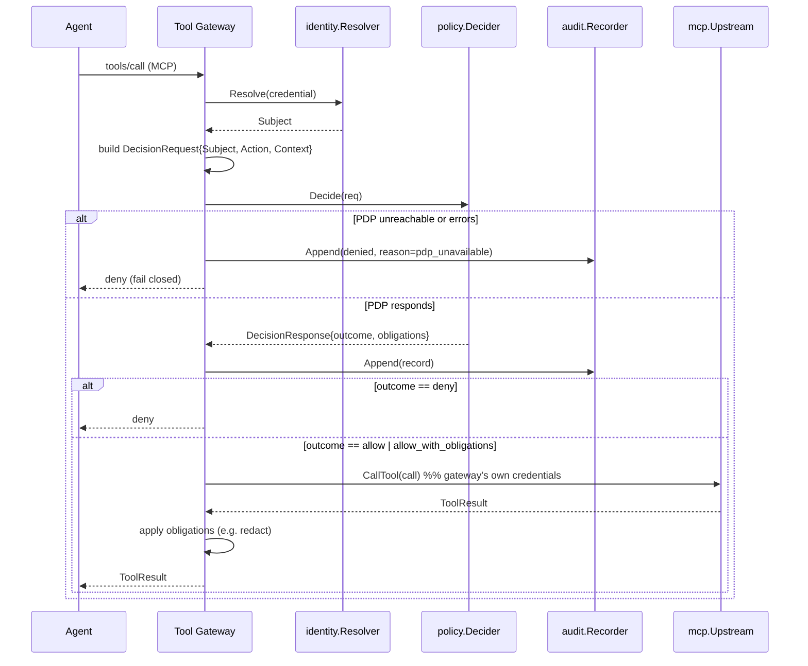

# Architecture

This document decomposes HelmDeep into components, states what each one is
responsible for, what interface it exposes to Go code in this repo, and how
it talks to the Tool Gateway — the one component fully implemented so far.

For the platform-level rationale (why these components exist, the four-plane
model, the design principles) see [`docs/02-architecture.md`](docs/02-architecture.md)
and the rest of `docs/`. This file is the concrete, code-level counterpart:
package paths, Go interfaces, and what's actually built versus stubbed in
*this* repo today.

## The threat this exists to address

The model is not a security boundary: indirect prompt injection can make an
agent attempt actions its operator never intended. The agent's own code is
not a security boundary either: a compromised dependency can bypass any
check that lives inside the agent process. So enforcement has to sit outside
the agent, on a path it cannot route around.

Concretely: the agent talks MCP to the Tool Gateway, believing it's talking
to the real tool server(s). The gateway decides what's allowed, records what
it decided, and only then forwards to the real upstream — using credentials
the agent never holds. An agent that's been fully hijacked by a malicious
tool result still cannot do anything the gateway's policy hasn't authorized,
because the authorization check isn't inside the process the injection
controls.

## Components

| Component | Status | Package |
|---|---|---|
| Tool Gateway | **Implemented** — full implementation, tested | `internal/gateway`, `cmd/helmdeep-gateway` |
| Policy Decision Point (PDP) | **Implemented** — embedded OPA/Rego engine | `pkg/policy` |
| Audit / Action Record store | **Implemented** — file-backed, hash-chained | `pkg/audit` |
| MCP protocol handling | **Implemented** — Streamable HTTP, 2026-07-28 spec | `pkg/mcp` |
| Identity & credential exchange | **Partial** — real JWT verification + credential broker (Milestone M1) | `pkg/identity`, `internal/devissuer` |
| Tool Registry | **Partial** — risk rating, data classes, required scopes; undeclared-tool refusal enforced (Milestone M2) | `pkg/toolregistry` |
| Agent Registry | **Partial** — owner, risk, data classes, optional version pin; undeclared-agent refusal enforced | `pkg/agentregistry` |
| Model Catalog | **Partial** — approved status, data classes, residency (descriptive); unapproved-model refusal enforced | `pkg/modelcatalog` |
| Policy Service | **Partial** — signed bundle manifests; a bundle that doesn't match is refused at load and reload; bundle version + digest recorded per action. No authoring, compilation, testing, or distribution | `pkg/policyservice` |
| Egress control | **Partial** — per-tool upstream allowlist, cloud-metadata block (Milestone M3) | `internal/gateway`, `pkg/mcp/egress.go` |
| Python SDK + dev emulator | **Partial** — wire-protocol client, dev-issuer binary, docker-compose emulator (Milestone M4) | `sdk/python`, `cmd/dev-issuer`, `examples/dev-emulator` |
| Model Gateway | **Partial** — 2 real providers, policy-gated, same ledger as the Tool Gateway (Milestone M5) | `pkg/modelgw` |
| Agent sandbox runtime | Interface only — no implementation | `pkg/sandbox` |
| Scheduler | Interface only — no implementation | `pkg/scheduler` |
| Control plane | Interface only — no implementation (Tool Registry moved out to its own package — see below) | `pkg/controlplane` |

### Tool Gateway — build now

**Responsibility.** The only component an agent ever talks to. Presents
itself as a single MCP server regardless of how many real upstream MCP
servers sit behind it. On every request it: resolves who's calling, asks the
PDP whether the call is allowed, enforces the verdict, writes an action
record, and — if allowed — forwards to the real upstream with its own
credentials, never the agent's.

**Interface.** `internal/gateway` (implementation, Step 2) wires together
`pkg/mcp.Listener`, `pkg/mcp.Registry`, `pkg/policy.Decider`,
`pkg/audit.Recorder`, and a `pkg/identity.Resolver`. `cmd/helmdeep-gateway`
is the binary entry point.

**Interaction.** This *is* the thing everything else plugs into — see the
request flow diagram below.

### Policy Decision Point (PDP)

**Responsibility.** Given a `types.DecisionRequest` (who, what action, what
context), return `allow`, `deny`, or `allow_with_obligations`. Stateless: it
compares the request against a loaded policy bundle and never tracks
counters or session state itself (the gateway supplies running usage via
`DecisionContext.Usage` — see [ADR 0002](docs/adr/0002-policy-engine-choice.md)).

**Interface.** `pkg/policy.Decider` (`Decide`) and `pkg/policy.Loader`
(`Load`, `Reload` — hot reload without restarting the gateway).

**Interaction.** The gateway calls `Decide` synchronously on every
`tools/call`, and on `tools/list` to filter the tool set to what the caller
may see. It is on the hot path — see the sub-5ms latency target in
`ROADMAP.md`.

### Audit / Action Record store

**Responsibility.** Durably record every decision the gateway makes —
allows *and* denials — as an append-only, hash-chained log, so the log is
tamper-evident and an auditor doesn't have to trust the gateway's word for
what happened.

**Interface.** `pkg/audit.Recorder` (`Append`) and `pkg/audit.Store`
(`Recorder` plus `Verify`, which walks the chain and reports the first
break).

**Interaction.** For irreversible or write actions, the gateway durably
appends the record *before* the side effect is issued — see
[ADR 0003](docs/adr/0003-fail-closed-behavior.md) and
[ADR 0004](docs/adr/0004-action-record-format.md).

### MCP protocol handling

**Responsibility.** Everything about being an MCP server and an MCP client,
targeting the current stateless MCP spec (2026-07-28) exclusively — see
[ADR 0005](docs/adr/0005-mcp-protocol-compatibility.md) for why "support
both eras" was rejected: two ways to resolve caller identity inside a policy
enforcement point is a bypass waiting to happen, not a compatibility
feature. The gateway validates `_meta`, the `MCP-Protocol-Version` /
`Mcp-Method` / `Mcp-Name` headers, and rejects anything it doesn't
understand cleanly (400/404/405 per spec) rather than guessing. Transport
for Step 2 is Streamable HTTP only; stdio is not implemented (a transport
gap, not a stub component — `pkg/mcp.Listener` doesn't change if it's added
later).

**Interface.** `pkg/mcp.Listener` (agent-facing), `pkg/mcp.Upstream` and
`pkg/mcp.Registry` (upstream-facing, multiple upstreams behind one
endpoint), `pkg/mcp.Handler` (the protocol-mechanical transport layer's
callback into gateway business logic — see below).

**Interaction.** `Listener` is where a `tools/call` request enters the
gateway; `Registry.Resolve` + `Upstream.CallTool` is how an allowed call
leaves it. The split between `pkg/mcp` and `internal/gateway` is
deliberate: `pkg/mcp` owns wire-protocol correctness (headers, `_meta`,
JSON-RPC framing, error codes) and knows nothing about policy or identity;
`internal/gateway` implements `pkg/mcp.Handler` and owns everything
policy-and-identity-shaped. A transport bug and a policy bug should never
be found in the same file.

### Identity & credential exchange — partial (Milestone M1)

**Responsibility.** Verify caller identity from a signed Session Identity
Token (SIT), and mint just-in-time, narrowly scoped, per-call credentials
for upstream calls instead of an upstream ever seeing an agent's own token
— see `docs/04-identity-authz.md` §1.1 and §3. Workload identity via real
SPIFFE/SPIRE and Enterprise IdP integration (§6) are not implemented; see
`docs/adr/0007-credential-broker-scope.md` for the complete list of what's
simplified in this milestone and why.

**Interface.** `pkg/identity.Resolver` (`Resolve(credential) -> Subject`),
`pkg/identity.CredentialBroker` (`Exchange(credential, upstream, tool) ->
token`).

**Implementations.** `pkg/identity.JWTResolver` verifies a SIT's signature
against a JWKS and extracts the agent principal and delegation chain.
`pkg/identity.HTTPCredentialBroker` calls an RFC-8693-shaped token-exchange
endpoint. `internal/devissuer` is the dev-only issuer/exchange server both
talk to in Phase 0 — see its own doc comment for why it plays both an
identity provider's and an authorization server's role at once.
`internal/gateway.StaticTokenResolver` remains as a dev/test fallback,
gated behind `cmd/helmdeep-gateway serve -dev-insecure`.

**Interaction.** The gateway depends on `identity.Resolver` and
`identity.CredentialBroker` — the interfaces, never a concrete
implementation — so swapping `JWTResolver` for a future SPIRE-backed
resolver, or `HTTPCredentialBroker` for a real external AS client, is a
wiring change in `cmd/helmdeep-gateway`'s `main`, not a change to
`internal/gateway`.

The static resolver logs a warning on startup — "static token identity
resolver active: development/test only, do not run in production" — and
its doc comment says the same, on top of the `-dev-insecure` flag gate
itself. It is a bootstrap convenience, not a security feature, and it
should be impossible to mistake it for one.

### Model Gateway, Agent sandbox runtime, Scheduler, Control plane — stubs

Not used by the Tool Gateway at all. They exist as interfaces so a future
agent runtime built in this monorepo has something to implement against
without restructuring what's here. See `docs/07-model-gateway.md`,
`docs/03-agent-runtime.md`, `docs/06-orchestration.md`, and
`docs/02-architecture.md` §2 (Control Plane) respectively for what they'll
eventually do.

## Request flow: a tool call traversing the system

The load-bearing property in this diagram: **the audit write and the
allow/deny decision happen before the agent sees anything**, and a PDP that
is unreachable or errors is treated identically to an explicit deny. Nothing
here fails open.

## Repo layout notes

The layout mostly follows what was proposed, with two additions.
**`pkg/controlplane`** wasn't in the original sketch, but the component
status table calls for a Control plane stub, and every other stub component
(`identity`, `modelgw`, `sandbox`, `scheduler`) got its own `pkg/` directory
for consistency. Adding a fifth stub package alongside them was more
consistent than leaving Control plane as the one component with no code at
all, or wedging it into an unrelated package.

**`pkg/toolregistry`** is a Control Plane service (`docs/02-architecture.md`
§2 lists the Tool Registry there) that got a real implementation
(Milestone M2) before `pkg/controlplane` itself got any — rather than
becoming the one non-stub corner of a package whose whole point is "not
implemented yet," it grew its own home. See `docs/adr/0008-tool-registry.md`.

**`pkg/agentregistry`** followed the same pattern for the Agent Registry,
also listed under Control Plane in doc 02 §2 — enforcing "undeclared
agent identities are refused" the same way `pkg/toolregistry` enforces it
for tools. See `docs/adr/0012-agent-registry.md`.

**`pkg/modelcatalog`** is the third: the Model Catalog, also under
Control Plane in doc 02 §2, gates `pkg/modelgw.Gateway` — a route's
provider+model must be an approved entry or the call is refused. See
`docs/adr/0013-model-catalog.md`.

**`pkg/policyservice`** is the fourth, and the only one that decorates
rather than gates: it wraps `pkg/policy.Loader` so a bundle that doesn't
match its signed manifest is never compiled, and wraps `pkg/audit.Store`
so every record names the bundle that decided it. It is a separate
package from `pkg/policy` on purpose — `pkg/policy` answers "what does
policy say about this request," and nothing about bundle provenance
belongs on the request path. See `docs/adr/0014-policy-service.md`.

`pkg/types` has no dependencies on any other package in this repo, by
design — everything else depends on it, so it cannot depend back without
creating an import cycle. If you find yourself wanting `pkg/types` to import
`pkg/policy` or `pkg/mcp`, that's a signal the type belongs somewhere else.

## Non-goals (this repo, this phase)

No sandbox/isolation runtime, no Model Gateway, no web UI, no multi-tenancy,
no SSO, no policy authoring GUI, no agent-side SDK. Interfaces only where
the architecture needs them, per the component status table above.

**Full legacy MCP protocol support (2025-11-25 and earlier) is a deliberate
non-goal**, not an oversight — see
[ADR 0005](docs/adr/0005-mcp-protocol-compatibility.md). The gateway
tolerates a legacy client just enough to reject it cleanly; it does not
serve one. Revisit only if a real user reports a real framework that can't
migrate, with the spec's twelve-month deprecation runway as context for how
much urgency that actually deserves.
